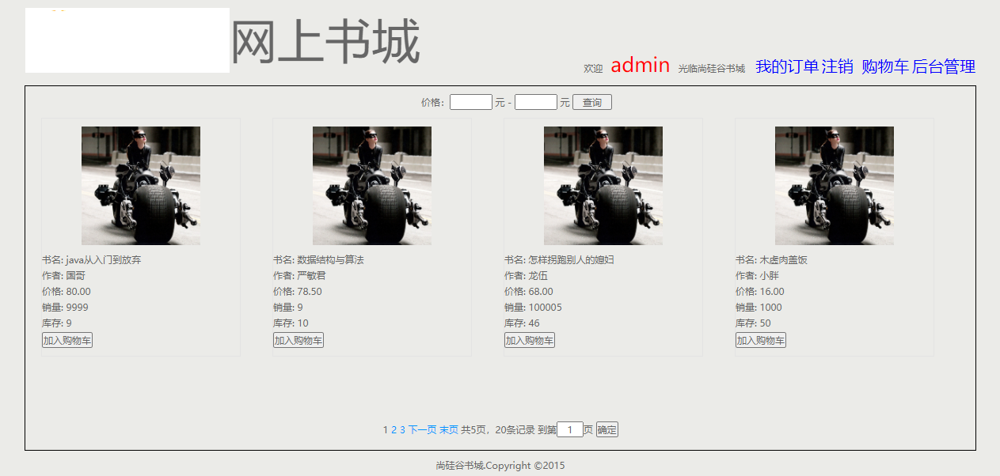

# 谷粒书城

## 项目简介

这是一个书城JavaWeb入门新手项目。



## 运行环境

- jdk 8
- tomcat 9
- mysql 8.0

## 技术栈

- tomcat
- mysql
- jsp
- jquery
- kaptcha
- druid

## 项目结构

```
book
├──bean 实体类
├──dao 数据访问层
├──filter 请求过滤器
├──service 业务服务
├──test 单元测试
├──utils 工具包
└──web 请求控制层
```

## 快速开始

### 1.克隆项目

使用git克隆项目到本地：

```bash
git clone https://github.com/welitis/book.git
```

### 2.配置环境

根据运行环境要求配置相应的环境变量和依赖。

### 3.构建项目

使用IDE打包项目war包


## 数据库配置

数据库连接配置参考`jdbc.properties`文件

## 功能介绍

1. 用户登录、注册、注销
2. 商品配置-新增商品-修改商品-删除商品
3. 订单管理-发货-待收货-确认收货
4. 库存管理-购买商品动态减少库存增加销量
5. 购物车管理-加入购物车-清空购物车-购物车结账
6. 商品根据价格范围查询、分页展示
7. 访问页面登录回显，访问的页面不丢失，登陆后重新跳回访问的页面


## 版权声明

Apache License 2.0

Copyright (c) 2020-2024 welisit